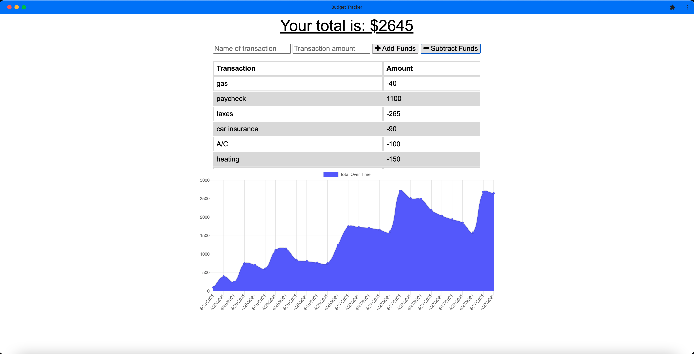

# budget-tracker

## Approach 

This budget-tracker is comprised of many working parts that all seamlessly come together to build a polished, professional application that keeps track of all the users expenses. The user is able to track the transaction name, transaction amount and whether or not the funds were added or subtracted. These expenses are compiled in a table giving a further breakdown and shows a chart so the user can easily look at and digest all of the information that is presented before them. The drive behind building this application is giving users a fast and easy way to track their money, however important that is, allowing them to access that information anytime is even more important. Having offline functionality is paramount to this applications success. Behind the scenes there is many technologies at play, one main one being mongoDB, cross-platform document-oriented database program, that will store our data that is recieved when the user is online. The other main one being indexedDB which allows us to store offline info right in the browser that can then be used when the page goes back online, the data is now stored in mongoDB and cleared from the indexdDB. The node modules that help along the way are mongoose, express, morgan, lite-server and compression. We are now introducing Gzip compression to boost performance and make the app run more smoothly. All of this comes together to make a user friendly, workout tracking application that will help users stay ahead of their expenses.

## Installation

To install this repo on your local drive you would have to clone the ssh key from my repo. Head into your local drive of choice in terminal or bash and do a git clone. Once you have done a git clone you are free to start working on this project. If you want to push your changes to my repo then you would have to head into terminal/bash and do a git add . Then a git commit -m explaning the changes made, and finally a git push to push the files onto the repo. 

## Usage 

If you want to use this program on the front end then simply click on the link in the finished project section of this read me. To see the offline functionality in use go into the url input at the top of the web page and click on the install budget tracker icon at the right hand side and you will be able to download a PWA of this application that will work entirely offline. If you would like to tinker with the back-end, first do a git clone as previously described. Once you have the all the folders in your vs code, make sure you do a npm install in the command line to install all the dependencies listed in the package.json. Then go to the server.js file and check the port you are listening on and make sure you are able to spin up a localhost:[PORT NUM]. Go into the intergrated terminal and run the command npm start. This will spin up a local server enabling you to make changes in your editor of choice and see them in the browser. 

## Finished project
Check out the live application on <a href="https://ancient-taiga-78237.herokuapp.com/">Heroku!</a>

## Features
<ul>
<li>A budget tracker that will help users keep track of their spending.</li>
<li>The user is able to view their expenses easily with the use of a table and a chart.</li>
<li>Can add expenses and deposits to their budget with or without a connection.</li>
<li>A user is able to enter transactions when they are offline.</li>
<li>All of the data is dyncamically altered whether the user is offline or online.</li>
<li>When the user goes back online the data persists and the updates to the total remain on the page.</li>
<li>Use of MongoDB to store the users data when they are online and brought back from offline.</li>
<li>IndexedDB is used to store the data when the user is offline. </li>
<li>When the user comes back from offline the data persists on the page and is deleted from indexedDB. </li>
<li>Service-worker handles all of the static and data caching. </li>
<li>Uses the node modules Mongoose, Express, Morgan, lite-server and compression</li>
<li>The Gzip compression enables faster loading of the webpage.</li>
<li>Application is hosted live on <a href="https://ancient-taiga-78237.herokuapp.com/">Heroku!</a>.</li>
</ul>

## Tests
N/A 

## Credits
N/A

## Contributing

Pull requests are welcome and encouraged. Hit me up on my github <a href="https://github.com/mattrward1030">mattrward1030</a>

## Badges
 

## License

MIT License

Copyright (c) [2021] [Matthew Ward]

Permission is hereby granted, free of charge, to any person obtaining a copy
of this software and associated documentation files (the "Software"), to deal
in the Software without restriction, including without limitation the rights
to use, copy, modify, merge, publish, distribute, sublicense, and/or sell
copies of the Software, and to permit persons to whom the Software is
furnished to do so, subject to the following conditions:

The above copyright notice and this permission notice shall be included in all
copies or substantial portions of the Software.

THE SOFTWARE IS PROVIDED "AS IS", WITHOUT WARRANTY OF ANY KIND, EXPRESS OR
IMPLIED, INCLUDING BUT NOT LIMITED TO THE WARRANTIES OF MERCHANTABILITY,
FITNESS FOR A PARTICULAR PURPOSE AND NONINFRINGEMENT. IN NO EVENT SHALL THE
AUTHORS OR COPYRIGHT HOLDERS BE LIABLE FOR ANY CLAIM, DAMAGES OR OTHER
LIABILITY, WHETHER IN AN ACTION OF CONTRACT, TORT OR OTHERWISE, ARISING FROM,
OUT OF OR IN CONNECTION WITH THE SOFTWARE OR THE USE OR OTHER DEALINGS IN THE
SOFTWARE.

